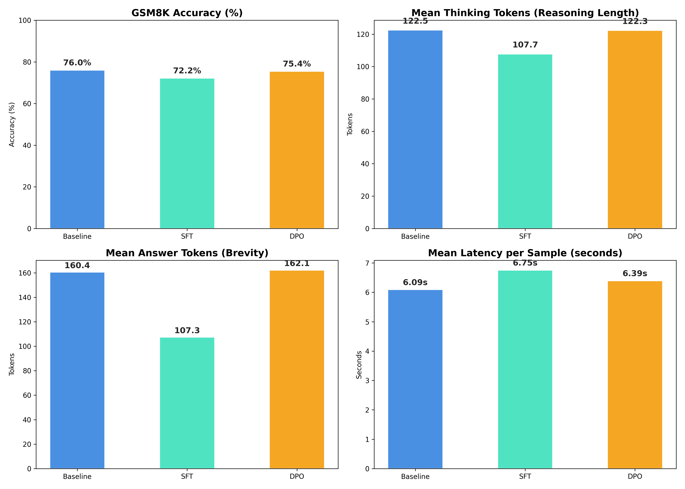
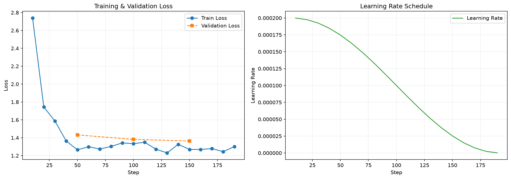

# Grug Reasoning Fine-Tune

Fine-tune reasoning language models to learn telegraphic, token-efficient internal chain-of-thought traces inside `<think>...</think>` tags without sacrificing mathematical problem-solving accuracy.

The project investigates the Grug hypothesis: whether language models can drop syntactic filler, polite hedging, and conversational padding inside their reasoning monologue, achieving lower generation latency and reduced inference cost.

## Project Evolution

The investigation progressed through two primary phases:

- Phase 1: Local Apple Silicon Experiments (1.5B)
  LoRA Supervised Fine-Tuning (SFT) of `deepseek-ai/DeepSeek-R1-Distill-Qwen-1.5B` using MLX on Apple Silicon (M4 GPU). Focused on dataset curation, prompt extraction, synthetic trace compression, and regularizing against prompt leakage.
- Phase 2: Cloud CUDA Scaling and Preference Optimization (7B)
  Scaled up to `deepseek-ai/DeepSeek-R1-Distill-Qwen-7B` on NVIDIA T4 GPUs via Kaggle. Built an end-to-end alignment pipeline combining 4-bit QLoRA SFT with Direct Preference Optimization (DPO) to penalize verbosity and repetitive reasoning loops.

## Hugging Face Hub Repositories

All trained weights, dataset splits, full-length evaluation logs, and visualization dashboards are published on Hugging Face:

- Model LoRA Adapters: [hari31416/deepseek-r1-7b-grug-adapters](https://huggingface.co/hari31416/deepseek-r1-7b-grug-adapters)
- Datasets and Benchmark Logs: [hari31416/grug-reasoning-data-and-benchmarks](https://huggingface.co/datasets/hari31416/grug-reasoning-data-and-benchmarks)

## Qualitative Example

Comparing standard verbose reasoning with compressed Grug reasoning:

### Standard Verbose Reasoning (Base Model)

```text
<think>
Okay, let me figure out how many eggs Janet sells each day. First, I need to read the problem carefully and identify the given numbers.
The problem states that Janet's ducks lay 16 eggs per day.
Next, it says she eats 3 eggs for breakfast every morning.
Then, it mentions that she bakes muffins for her friends every day with 4 eggs.
The remaining eggs are sold at the farmers market for $2 each.
Let me calculate how many eggs are used each day before selling.
Eggs eaten: 3.
Eggs for baking: 4.
Total eggs used: 3 + 4 = 7 eggs.
Now, subtract the used eggs from the total laid eggs: 16 - 7 = 9 eggs.
So she sells 9 eggs each day.
Now, to find how much money she makes: 9 eggs * $2 = $18.
Everything looks correct.
</think>
Janet makes $18 every day at the farmers market.
```

### Compressed Grug Reasoning (Fine-Tuned Model)

```text
<think>
- ducks lay 16 eggs/day
- eats 3 for breakfast
- bakes with 4
- total used: 3 + 4 = 7
- remaining: 16 - 7 = 9 eggs
- price: $2 each -> 9 * 2 = 18
</think>
Janet makes $18 every day.
```

## DeepSeek-R1-7B Benchmark Results

All models were evaluated across the complete GSM8K test split (1,319 samples) on an NVIDIA T4 GPU:

| Model Variant | Test Samples | Accuracy | Format Compliance | Mean Thinking Tokens | Mean Answer Tokens | Mean Latency |
| :--- | :---: | :---: | :---: | :---: | :---: | :---: |
| Base Model (7B) | 1,319 | 75.97% | 99.85% | 122.5 | 160.4 | 6.09s |
| SFT Adapter (7B) | 1,319 | 72.18% | 94.62% | 107.7 | 107.3 | 6.75s |
| DPO Adapter (7B) | 1,319 | 75.44% | 99.85% | 122.3 | 162.1 | 6.39s |

### Key Benchmark Insights

- Answer Brevity: The SFT adapter reduced final answer length from 160.4 tokens to 107.3 tokens (a 33.1% reduction in output verbosity).
- Eliminating Degenerate Loops: SFT without preference tuning can get stuck in repetitive derivation loops on out-of-distribution math questions, consuming the token budget before closing `<think>`. DPO cured this behavior, restoring format compliance to 99.85%.
- Accuracy Retention: DPO retained 75.44% accuracy on GSM8K (within 0.5% of the uncompressed base model) while eliminating filler language.

## Benchmark Visualizations

The 4-panel comparative dashboard illustrates accuracy, thinking length, answer length, and per-sample latency across all three evaluated variants on the full 1,319 GSM8K test split:



The training dynamics of the DPO alignment stage show stable loss convergence:



## DeepSeek-R1-1.5B Local Experiments

Earlier proof-of-concept experiments evaluated on subsets of GSM8K using Apple Silicon MLX:

### Iteration 1 Metrics (GSM8K Test Split)

| Configuration | Accuracy | Mean Thinking Tokens | Mean Total Tokens | Mean Latency | Format Compliance |
| :--- | :---: | :---: | :---: | :---: | :---: |
| Base Normal | 64.9% | 219.0 | 477.4 | 0.88s | 96.6% |
| Base Grug | 67.2% | 512.8 | 581.1 | 1.21s | 91.5% |
| FT Normal | 66.0% | 156.2 | 389.3 | 0.73s | 98.9% |
| FT Grug | 45.6% | 120.0 | 229.0 | 0.64s | 95.1% |

### Iteration 2 (Regularized) Metrics (GSM8K Test Split)

| Configuration | Accuracy | Mean Thinking Tokens | Mean Total Tokens | Mean Latency | Format Compliance |
| :--- | :---: | :---: | :---: | :---: | :---: |
| Base Model (Style Prompt) | 70.1% | 517.4 | 582.1 | 1.28s | 91.1% |
| FT Model (Regularized) | 54.6% | 135.0 | 214.7 | 0.61s | 98.2% |

## Project Structure

```text
qwen-finetune/
├── adapters/                 # LoRA adapter checkpoints (gitignored)
├── data/                     # SFT and DPO training and validation splits
│   ├── dpo/                  # Preference pairs (train.jsonl, valid.jsonl)
│   ├── sft/                  # SFT chat demonstrations
│   ├── train.jsonl
│   └── valid.jsonl
├── notebooks/                # Kaggle execution pipelines
│   ├── kaggle_benchmark_all.ipynb   # Unified 1,319-sample benchmark suite
│   ├── kaggle_dpo_pipeline.ipynb    # End-to-end DPO training pipeline
│   └── kaggle_sft_pipeline.ipynb    # End-to-end SFT training pipeline
├── report/                   # Evaluation reports and figures
│   ├── deepseek-r1-7b/       # 7B comparison dashboard, reports, loss plots
│   ├── it-1/                 # 1.5B iteration 1 analysis
│   ├── REPORT.md             # 1.5B iteration 2 comprehensive report
│   └── STORY.md              # Project retrospective and narrative
├── results/                  # Raw evaluation JSON records (gitignored)
├── scripts/                  # Training, evaluation, and synchronization scripts
│   ├── cuda/                 # CUDA training and evaluation scripts
│   ├── sync_to_hf_v2.py      # Hugging Face upload script for models and data
│   ├── train.py              # MLX LoRA training script
│   └── eval.py               # MLX evaluation script
└── config.yaml               # Model targets and hyperparameters
```

## Getting Started

### Local Setup (Apple Silicon)

Initialize and sync the virtual environment using `uv`:

```bash
uv sync
```

Verify that MLX has Apple Silicon GPU access:

```bash
uv run python -c "import mlx.core as mx; print(mx.default_device())"
```

Configure environment variables by copying `.env.example` to `.env`:

```bash
cp .env.example .env
```

### Running Local Training and Evaluation

Target `make` commands are provided for local workflows:

```bash
# View list of available commands
make help

# 1. Run local MLX SFT Training
make train

# 2. Run Baseline Model Evaluation
make eval-base

# 3. Run Fine-Tuned Model Evaluation
make eval-ft

# 4. Generate comparative plots
make plot
```

### Reproducing the 7B Benchmark on Kaggle

To reproduce the full 1,319-sample evaluation on Kaggle:

1. Open `notebooks/kaggle_benchmark_all.ipynb` in a Kaggle notebook.
2. Select Accelerator: GPU T4 x 2.
3. Run all cells. The pipeline will evaluate Baseline, SFT, and DPO sequentially, save defensive checkpoint logs, generate the 4-panel dashboard plot, and export a downloadable zip archive (`kaggle_benchmark_artifacts.zip`).
