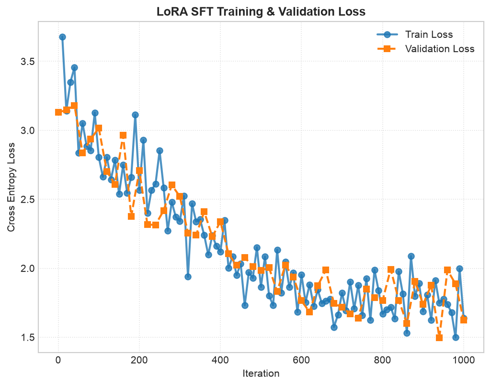
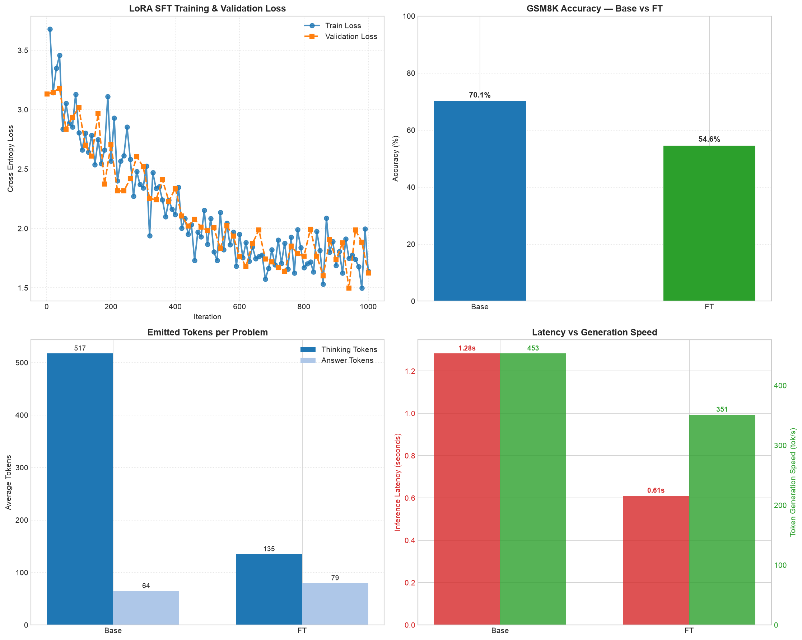
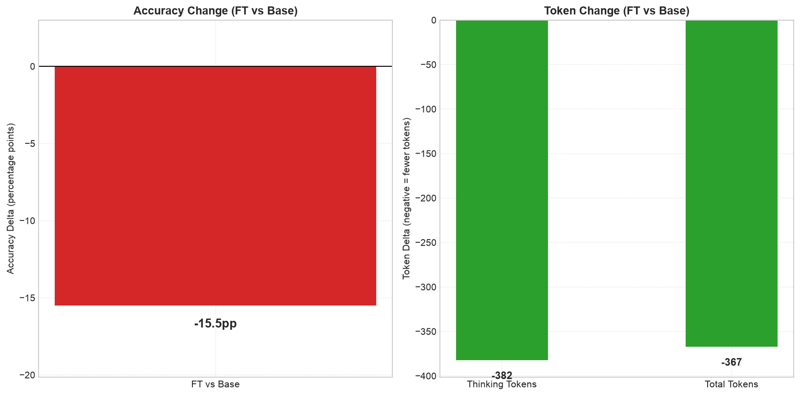

# Experimental Report: Grade School Math SFT Alignment (Iteration 2)

This report documents the results of fine-tuning the target reasoning model using regularized SFT and prompt-dropout constraints to learn a telegraphic, token-efficient reasoning style. The objectives are to eliminate system prompt regurgitation (prompt leakage) and evaluate the trade-offs in Grade School Math (GSM8K) accuracy.

## 1. Experimental Setup

- **Base Model:** `mlx-community/DeepSeek-R1-Distill-Qwen-1.5B-4bit` (4-bit quantized DeepSeek-R1 distill variant).
- **SFT Dataset:** 1,701 total samples (1,530 training examples / 171 validation examples) stratified across StrategyQA, LogiQA, BoolQ, ANLI, PIQA, and ReClor.
- **Regularization Strategy:**
  - **System Prompt Dropout:** 20% of the positive (compressed reasoning) examples had the style system prompt omitted during formatting.
  - **Negative Example Mixture:** 30% of SFT instances (392 rows) used normal, uncompressed reasoning traces (`raw_thinking`).
  - **Negative System Prompting:** 50% of the negative instances retained the system prompt to train the model not to over-compress reasoning blocks unconditionally.
- **Fine-Tuning Parameters:**
  - **Optimizer:** AdamW
  - **Learning Rate:** $5\times 10^{-6}$
  - **Batch Size:** 2 (gradient accumulation steps: 2, effective batch size: 4)
  - **Iterations:** 1,000
  - **Save & Evaluation Frequency:** Every 20 iterations
  - **LoRA Target Layers:** 16 layers (rank=16, alpha=32, scale=2.0)

## 2. SFT Training & Convergence

Training was executed on Apple Silicon (GPU via MLX). The validation loss converged smoothly:

- **Starting Loss:** Validation loss of **`3.131`** at step 1.
- **Best Validation Step:** Iteration **940** achieved the lowest validation loss of **`1.497`** (with training loss at **`1.997`**).
- **Model Selection:** The script successfully copied iteration 940 weights to `best_adapters.safetensors` and active `adapters.safetensors`.

The complete training loss progression is shown below:

## 3. Evaluation Metrics

Evaluations were performed on all 1,000 test samples of the Grade School Math (GSM8K) benchmark test split. Under the new protocol (Base vs. FT evaluated under the Style System Prompt), the results are:

### Summary Statistics

| Metric                       | Base Model | Fine-Tuned Model |  Delta   |
| :--------------------------- | :--------: | :--------------: | :------: |
| **Accuracy**                 |   70.1%    |      54.6%       | -15.5 pp |
| **Mean Thinking Tokens**     |   517.4    |      135.0       |  -73.9%  |
| **Mean Total Tokens**        |   582.1    |      214.7       |  -63.1%  |
| **Mean Latency (s)**         |   1.28s    |      0.61s       |  -52.3%  |
| **Generation Speed (tok/s)** |   453.6    |      351.3       |  -22.6%  |
| **Format Compliance**        |   91.1%    |      98.2%       | +7.1 pp  |

Below is the consolidated performance comparison dashboard:

## 4. Performance & Efficiency Deltas

Direct deltas comparing the fine-tuned model to the baseline model under the style prompt:

### Key Findings & Achievements

- **Prompt Leakage Successfully Eliminated:** The instruction collapse and system prompt regurgitation (where the model repeated rules like *"Final answer inside the thinking block..."*) observed in Iteration 1 has been completely resolved. This confirms that the combined prompt dropout (20%) and negative prompt mixing (50% of negative examples retaining system prompts) successfully regularized the model's behavior.
- **High Format Compliance:** Format compliance rate improved from **91.1%** to **98.2%**, showing that the model reliably structures its outputs inside parseable `<think>` blocks.
- **Significant Latency and Token Reductions:** Emitted thinking tokens dropped by **73.9%** (from 517.4 to 135.0 tokens on average), which cut the average inference latency by **52.3%** (from 1.28s to 0.61s).
- **Alignment Tax on Reasoning Accuracy:** The model experienced a **15.5 percentage point** drop in accuracy (from 70.1% down to 54.6%). Because the SFT dataset contains only general-reasoning tasks and lacks math-specific (GSM8K) examples, the model over-compresses mathematical derivations, dropping critical calculations and calculations. This directly motivates the benchmark SFT mixing planned for Iteration 3.
