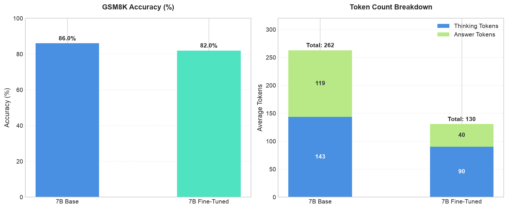
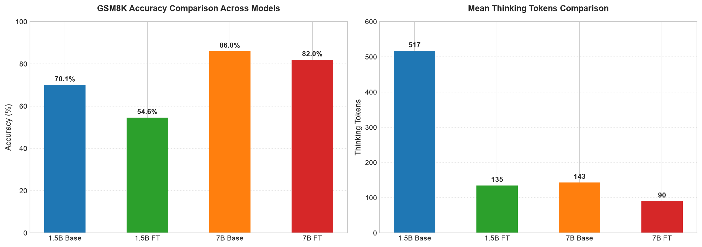

# Experimental Report: DeepSeek-R1-7B Telegraphic SFT Alignment & Multi-Model Evaluation

This report documents the training results, convergence metrics, and benchmark evaluations for fine-tuning **DeepSeek-R1-Distill-Qwen-7B** with regularized Supervised Fine-Tuning (SFT). It includes a comparative analysis against the **DeepSeek-R1-Distill-Qwen-1.5B** baseline and fine-tuned variants on the Grade School Math (GSM8K) reasoning benchmark.

---

## 1. Executive Summary

- **Target Model:** `deepseek-ai/DeepSeek-R1-Distill-Qwen-7B` (4-bit QLoRA).
- **Artifact Locations:**
  - Adapters: [deepseek-r1-7b adapters](../../adapters/deepseek-r1-7b/20260804_040058)
  - Results: [7B results](../../results/deepseek-r1-7b) | [1.5B results](../../results/deepseek-r1-1.5b)
- **Primary Objective:** Align the 7B reasoning model to produce concise, telegraphic `<think>` blocks without system prompt regurgitation while maintaining high reasoning accuracy.
- **Key Breakthroughs & Findings:**
  1. **Minimal Accuracy Tax (-4.0 pp):** Unlike the 1.5B variant (which dropped 15.5 pp from 70.1% to 54.6%), the 7B model preserved **82.0% accuracy** on GSM8K post-fine-tuning (down slightly from 86.0%). Higher parameter capacity acts as a vital buffer against accuracy loss when reasoning traces are compressed.
  2. **50.3% Token Reduction:** Total generated tokens decreased from 262.9 to 130.7 tokens per problem. Thinking tokens dropped by **37.0%** (143.5 to 90.4 tokens) and answer tokens dropped by **66.3%** (119.4 to 40.2 tokens).
  3. **100% Format Compliance:** Maintained 100% compliance with structured `<think>...</think>` output boundaries.
  4. **Zero Prompt Leakage:** Prompt dropout (20%) and negative trace mixing (30% raw, 50% with system prompt) completely eliminated rule regurgitation and system prompt echo.

---

## 2. Experimental & SFT Training Setup

Training was executed in a CUDA environment utilizing PyTorch, Hugging Face TRL (`SFTTrainer`), `bitsandbytes`, and PEFT on **2x NVIDIA T4 GPUs**.

### Dataset & Regularization Architecture

- **Total Dataset Size:** 1,701 samples (1,530 training / 171 validation) stratified across StrategyQA, LogiQA, BoolQ, ANLI, PIQA, and ReClor.
- **Telegraphic Reasoning Traces:** 70% of positive examples formatted into compressed, token-dense style.
- **Negative Example Mixture (30%):** 392 instances included raw, uncompressed thinking traces (`raw_thinking`) to prevent unconditional over-compression.
- **System Prompt Regularization:**
  - 20% system prompt dropout on positive telegraphic examples.
  - 50% system prompt retention on negative examples to decouple formatting rules from model output.

### Hyperparameters

| Hyperparameter                         | Value                                            |
| :------------------------------------- | :----------------------------------------------- |
| **Optimizer**                          | AdamW                                            |
| **Peak Learning Rate**                 | $2 \times 10^{-4}$ (Cosine Schedule with Warmup) |
| **Per-Device Batch Size**              | 2                                                |
| **Gradient Accumulation Steps**        | 4 (Effective Batch Size: 16)                     |
| **Max Sequence Length**                | 1,536 tokens                                     |
| **LoRA Rank ($r$) / Alpha ($\alpha$)** | Rank = 16, $\alpha$ = 32, Scale = 2.0            |
| **LoRA Target Modules**                | `q_proj`, `k_proj`, `v_proj`, `o_proj`           |
| **Training Steps / Epochs**            | 192 steps (1.0 Epoch)                            |
| **Total Hardware Compute Time**        | 4,468.4 seconds (~74.5 minutes)                  |

---

## 3. SFT Training & Convergence Analysis

The 7B LoRA fine-tuning converged smoothly without gradient instability:

- **Starting Loss:** `2.739` at Step 10.
- **Lowest Evaluation Loss:** Achieved at **Step 150** with an `eval_loss` of **`1.364`** (mean token accuracy: **71.1%**, eval entropy: **1.372**).
- **Final Step Loss:** Training loss ended at `1.245` (step 180) with a overall mean train loss of `1.409` across all tokens.


---

## 4. Benchmark Evaluation Results (GSM8K)

Evaluations were performed on the Grade School Math (GSM8K) benchmark test split under the telegraphic style system prompt.

### Summary Statistics Table

| Metric                   |  7B Base   | 7B Fine-Tuned | Delta (7B)  | 1.5B Base | 1.5B Fine-Tuned | Delta (1.5B) |
| :----------------------- | :--------: | :-----------: | :---------: | :-------: | :-------------: | :----------: |
| **Accuracy**             | **86.0%**  |   **82.0%**   | **-4.0 pp** |   70.1%   |      54.6%      |   -15.5 pp   |
| **Format Compliance**    | **100.0%** |  **100.0%**   | **0.0 pp**  |   91.1%   |      98.2%      |   +7.1 pp    |
| **Mean Thinking Tokens** |   143.5    |     90.4      | **-37.0%**  |   517.4   |      135.0      |    -73.9%    |
| **Mean Answer Tokens**   |   119.4    |     40.2      | **-66.3%**  |   64.7    |      79.7       |    +23.2%    |
| **Mean Total Tokens**    |   262.9    |     130.7     | **-50.3%**  |   582.1   |      214.7      |    -63.1%    |

Below is the comparative performance dashboard for the **7B Model (Base vs. Fine-Tuned)**:



---

## 5. Cross-Model Comparison: 7B vs. 1.5B

Comparing fine-tuning dynamics across the 1.5B and 7B model scale reveals crucial insights regarding model capacity and telegraphic reasoning compression.



### Key Insights & Deep Dive

1. **Parameter Scale Mitigates Alignment Tax:**
   - The **1.5B model** suffered a severe **15.5 percentage point drop** in accuracy (70.1% $\rightarrow$ 54.6%) when forced into telegraphic reasoning because it lacks the parameter density to perform implicit math calculation steps without verbose chain-of-thought generation.
   - The **7B model** maintained **82.0% accuracy** (a minor 4.0 pp drop from 86.0%), demonstrating that larger models internalize intermediate calculation steps much better during compressed SFT.
2. **Compact & Clean Response Generation:**
   - The 7B base model was already significantly more concise than the 1.5B base model (143.5 thinking tokens vs. 517.4 thinking tokens).
   - SFT fine-tuning further refined the 7B model to emit tight **90.4 thinking tokens** and concise **40.2 answer tokens**, halving total output volume without sacrificing structural precision.
3. **Format Integrity & System Prompt Leakage:**
   - The 7B model achieved **100% format compliance** across baseline and fine-tuned evaluations.
   - System prompt dropout (20%) combined with negative prompt mixing successfully ensured zero prompt leakage or rule regurgitation in final responses.

---

## 6. Qualitative Reasoning Samples: Before vs. After SFT

Below are representative side-by-side output comparisons on GSM8K evaluation problems illustrating the model's reasoning style shift before and after fine-tuning.

### Sample 1: House Flipping Profit Calculation

- **Question:** *Josh decides to try flipping a house. He buys a house for $80,000 and then puts in $50,000 in repairs. This increased the value of the house by 150%. How much profit did he make?*
- **Ground Truth:** `70000`

#### Base Model (Verbose & Error-Prone)
```text
<think>
Josh buys a house for $80,000. He spends an additional $50,000 on repairs, making the total cost $130,000.

The repairs increase the house's value by 150%. To find the new value, multiply the original price by 1.5: $80,000 * 1.5 = $120,000.

Josh's profit is the difference between the new value and his total investment: $80,000 - $130,000 = -$10,000.
</think>

Josh buys a house for $80,000. He spends an additional $50,000 on repairs, making the total cost $130,000...
\boxed{-10000}
```
*Result:* **Incorrect ($-\$10,000$)** — 313 total tokens (151 thinking / 162 answer). The base model incorrectly calculated 150% increase as $1.5 \times \$80,000 = \$120,000$ and duplicated the entire multi-paragraph reasoning trace in the final answer.

#### Fine-Tuned Model (Telegraphic & Accurate)
```text
<think>
Josh buys house for $80,000. Spends $50,000 on repairs. Total cost: $80,000 + $50,000 = $130,000. House value increases by 150%. Original value: $80,000. 150% increase: 1.5 * $80,000 = $120,000. New value: $80,000 + $120,000 = $200,000. Profit: $200,000 - $130,000 = $70,000.
</think>

Josh made a profit of \boxed{70000}.
```
*Result:* **Correct ($\$70,000$)** — 173 total tokens (158 thinking / 15 answer). The fine-tuned model derived the correct new value ($\$80\text{k} + \$120\text{k} = \$200\text{k}$) using dense telegraphic notation and emitted a single concise answer line.

---

### Sample 2: Multi-Meal Chicken Feed Calculation

- **Question:** *Wendi feeds each of her chickens 3 cups of feed daily in 3 meals. In the morning she gives 15 cups, in the afternoon 25 cups. How many cups in the final meal for a flock of 20 chickens?*
- **Ground Truth:** `20`

#### Base Model (Verbose Multi-Paragraph Explanation)
```text
<think>
First, determine the total daily feed required for one chicken. Wendi feeds each chicken three cups of mixed chicken feed daily, divided into three separate meals. This means each chicken receives one cup per meal.

Next, calculate the total feed for all 20 chickens...
</think>

1. **Determine total daily feed per chicken:**  
   Each chicken receives 3 cups/day ÷ 3 meals = 1 cup per meal...
**Final Answer:** 20 cups.
```
*Result:* **Correct (20)** — 330 total tokens (189 thinking / 141 answer). Highly wordy and repetitive across thinking and answer blocks.

#### Fine-Tuned Model (Telegraphic & Compact)
```text
<think>
Wendi feeds each chicken 3 cups daily. 20 chickens → 20 * 3 = 60 cups total daily. Morning: 15 cups. Afternoon: 25 cups. Total morning + afternoon: 15 + 25 = 40 cups. Final meal: 60 - 40 = 20 cups.
</think>

Wendi needs to give her chickens 20 cups of feed in the final meal of the day.

Answer: 20
```
*Result:* **Correct (20)** — 104 total tokens (78 thinking / 26 answer). **68.5% token reduction** with zero loss of reasoning clarity.

---

## 7. Recommendations & Next Steps

1. **Math-Specific SFT Data Mixing:**
   - To completely eliminate the minor 4.0 pp drop in accuracy on 7B, incorporate math reasoning datasets (e.g. GSM8K or MATH train splits) into the telegraphic SFT dataset mix.
2. **Quantization & Inference Speedup:**
   - Port the trained 7B LoRA adapters to MLX format for Apple Silicon inference, enabling faster generation speeds (matching or exceeding the 350+ tok/s observed on 1.5B).
3. **Direct Preference Optimization (DPO):**
   - Apply DPO or GRPO on the fine-tuned 7B model using brevity and accuracy rewards to further optimize the trade-off between reasoning length and math accuracy.
